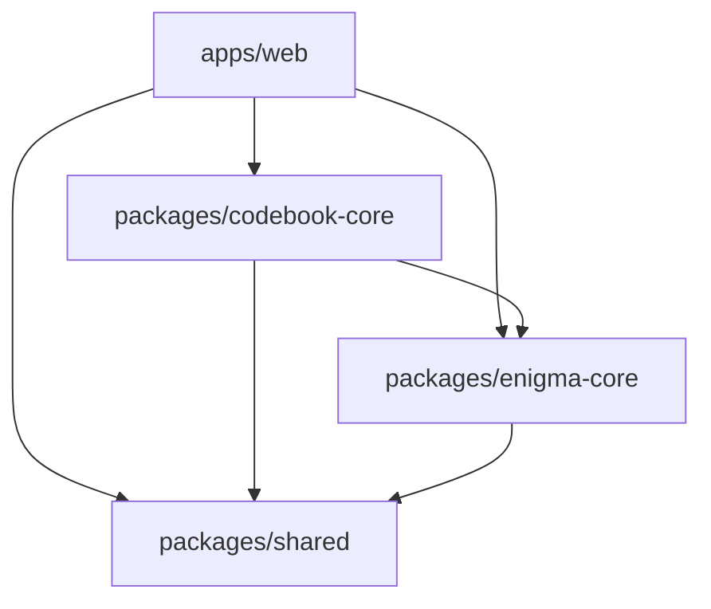

# Kiến trúc

## Mục tiêu

- Logic Enigma và Codebook có thể chạy trong web, Node.js test hoặc ứng dụng khác.
- UI có thể thay đổi mà không sửa thuật toán.
- Nhân sự mới và AI Agent tìm được nguồn sự thật nhanh chóng.
- Bản HTML độc lập tiếp tục hoạt động trong quá trình chuyển đổi.

## Dependency direction

Package core không được phụ thuộc ngược vào `apps/web`.

## Vai trò từng khu vực

| Khu vực | Trách nhiệm |
|---|---|
| `apps/web` | React UI, browser adapters, routing và trạng thái trình bày |
| `enigma-core` | Validation cấu hình, stepping, signal path, mã hóa/giải mã |
| `codebook-core` | Schema, validation, seeded PRNG, khóa ngày/tháng, mapping sang máy |
| `shared` | Hợp đồng nhỏ dùng chung, không chứa nghiệp vụ Enigma |
| `fixtures` | Dữ liệu mẫu ổn định dùng cho test và tài liệu |
| `legacy` | Snapshot v1.5; chỉ sửa khi cần hotfix compatibility |

## Quy tắc adapter

Các hành vi browser như `localStorage`, File API, Clipboard và download phải nằm trong web app. Core chỉ nhận dữ liệu và trả dữ liệu/exception miền nghiệp vụ.

## Backend

Repo chưa có `apps/api`. Chỉ thêm backend khi có nhu cầu thật như đăng nhập, đồng bộ nhiều thiết bị, phân quyền, audit hoặc chia sẻ Codebook. Khi đó tạo ADR mới trước khi triển khai.
