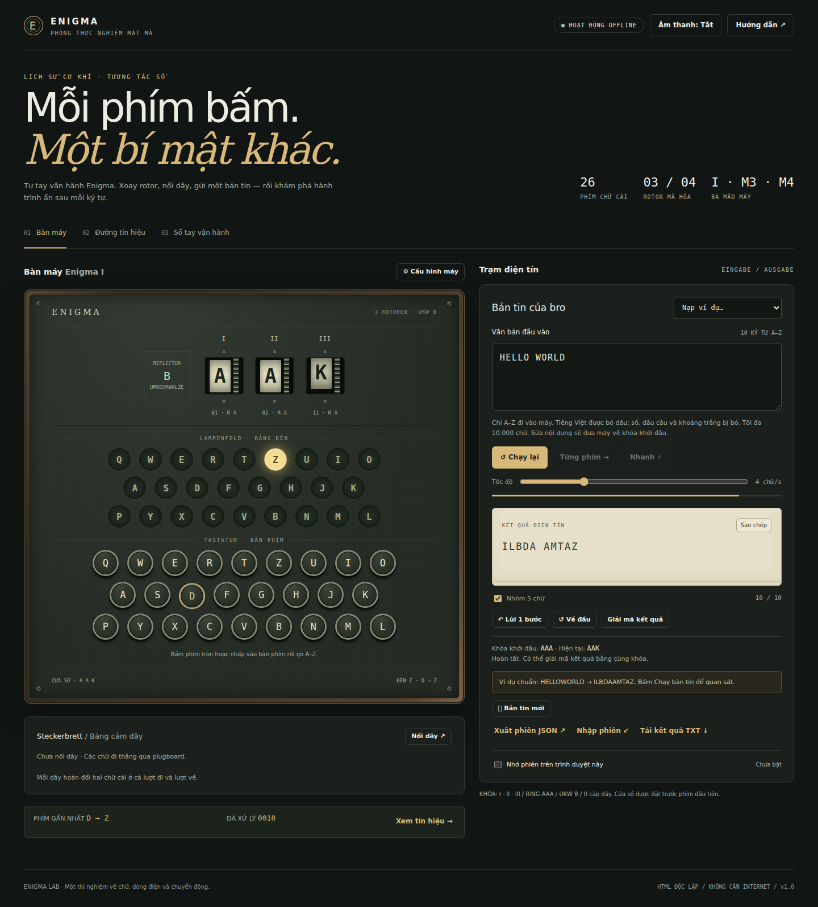
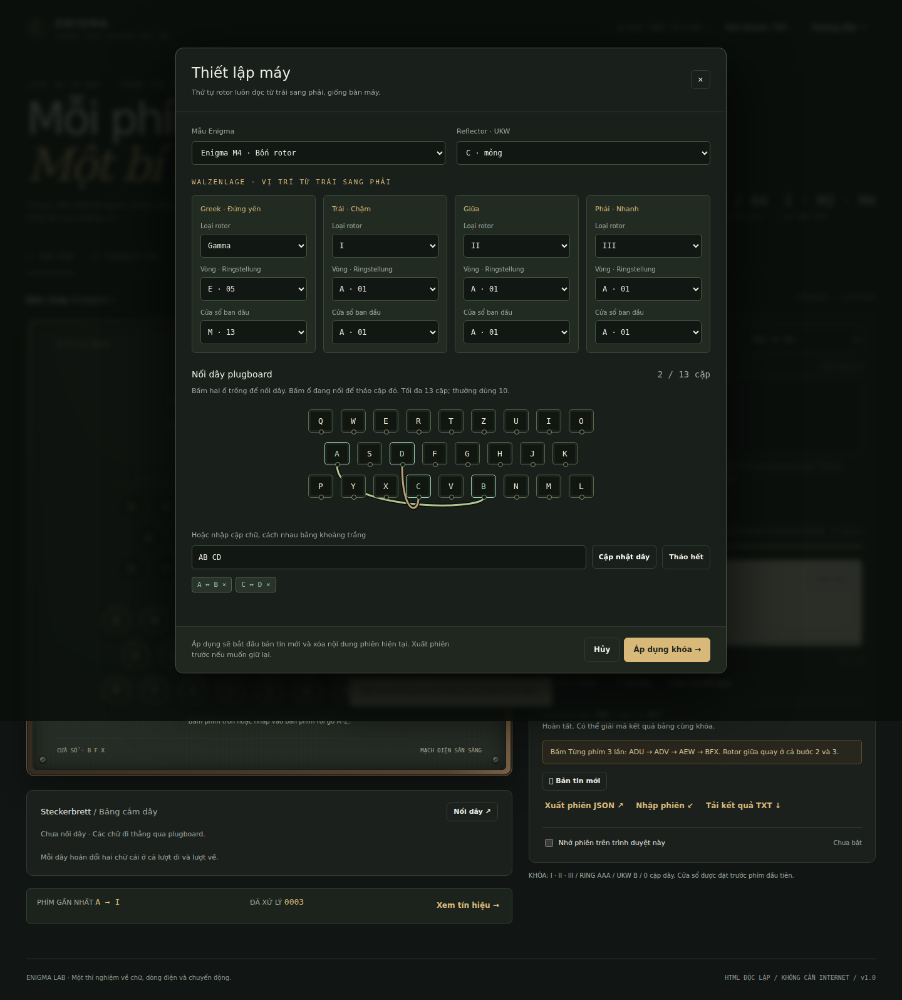
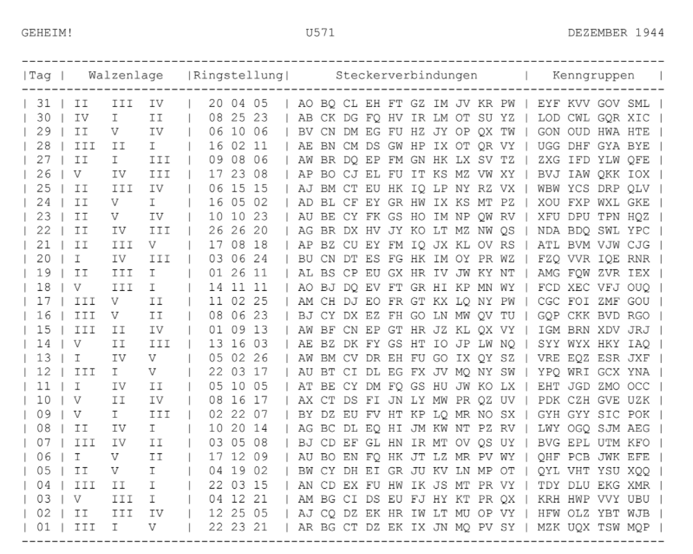
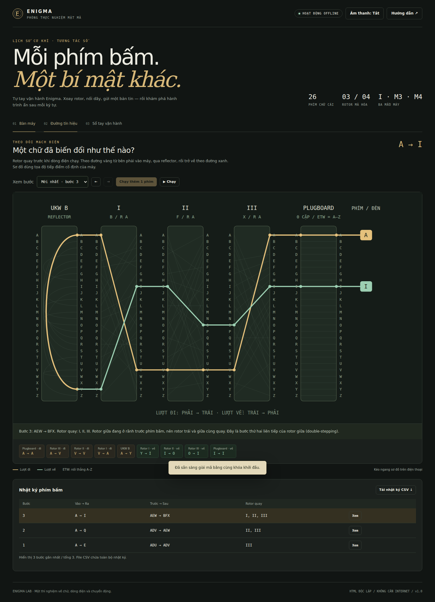
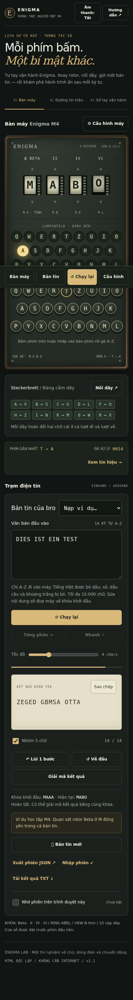

# Hướng dẫn sử dụng Enigma Lab

Tài liệu này dành cho người mới, đi từ mở bản demo đến mã hóa, giải mã, dùng Codebook và xem đường tín hiệu.

> Enigma Lab chỉ dùng để học tập và mô phỏng lịch sử. Enigma đã bị phá mã; không nhập mật khẩu, token, dữ liệu cá nhân hoặc thông tin cần bảo mật thật.

## 1. Mở ứng dụng

### Cách nhanh nhất: dùng file demo

1. Mở thư mục [`demo/`](../demo/).
2. Tải file [`enigma_simulator.html`](../demo/enigma_simulator.html) về máy.
3. Nhấp đúp file hoặc chọn **Open with → Chrome / Edge / Firefox**.
4. Ứng dụng chạy offline, không cần cài server.

### Chạy từ source dành cho developer

```bash
corepack enable
pnpm install --frozen-lockfile
pnpm dev
```

Mở địa chỉ Vite hiển thị trong terminal, mặc định là `http://localhost:5173`.

## 2. Làm quen với màn hình chính



Màn hình có hai khu vực chính:

- **Bàn máy**: rotor, bảng đèn, bàn phím và plugboard.
- **Trạm điện tín**: nhập bản tin, điều khiển tốc độ và nhận kết quả.

Thanh tab phía trên dùng để chuyển giữa **Bàn máy**, **Đường tín hiệu**, **Codebook** và **Sổ tay**. Ảnh minh họa Bàn máy được chụp trước khi tab Codebook được bổ sung; bố cục thao tác chính vẫn giống bản v1.5.

## 3. Mã hóa bản tin đầu tiên

1. Mở tab **Bàn máy**.
2. Giữ cấu hình mặc định:
   - Model: Enigma I.
   - Rotor trái → phải: `I II III`.
   - Ringstellung: `01 01 01`.
   - Cửa sổ khởi đầu: `AAA`.
   - Reflector: `B`.
   - Plugboard: chưa nối dây.
3. Nhập `HELLO WORLD` vào ô **Văn bản đầu vào**.
4. Chọn một cách chạy:
   - **Chạy bản tin**: chạy theo tốc độ đã chọn.
   - **Từng phím**: xử lý một ký tự để quan sát rotor.
   - **Nhanh**: xử lý ngay phần còn lại.
5. Khi bật **Nhóm 5 chữ**, kết quả chuẩn là:

```text
ILBDA AMTAZ
```

Ứng dụng chỉ đưa A–Z vào máy. Tiếng Việt được bỏ dấu; số, ký hiệu và khoảng trắng bị loại bỏ và không tự phục hồi khi giải mã.

## 4. Giải mã kết quả

Enigma không có thuật toán giải mã riêng. Cùng cấu hình và cùng vị trí ban đầu sẽ biến bản mã trở lại bản rõ.

1. Sau khi mã hóa, bấm **Giải mã kết quả**.
2. Ứng dụng đưa rotor về vị trí khởi đầu và nạp bản mã vào ô nhập.
3. Bấm **Nhanh** hoặc **Chạy bản tin**.
4. Kết quả trở lại `HELLOWORLD` sau khi bỏ nhóm 5 chữ.

Nếu tự giải mã thủ công, bro phải giữ đúng model, reflector, thứ tự rotor, Ringstellung, plugboard và cửa sổ khởi đầu.

## 5. Thay đổi cấu hình máy



Mở **Cấu hình máy** rồi thiết lập:

| Thành phần | Cách nhập |
|---|---|
| Mẫu máy | Enigma I, M3 hoặc M4 |
| Rotor | Đọc từ trái sang phải; ba rotor chuyển động không được trùng |
| Ringstellung | Giá trị 01–26, là độ lệch vòng chữ so với lõi dây |
| Cửa sổ ban đầu | Chữ nhìn thấy trước phím đầu tiên |
| Reflector / UKW | Chọn loại phù hợp với model |
| Plugboard | Mỗi chữ chỉ thuộc tối đa một cặp, ví dụ `AV BS CG` |

Với M4, rotor đầu tiên phải là `Beta` hoặc `Gamma`; rotor Greek này đứng yên. Sau khi kiểm tra cấu hình, bấm **Áp dụng khóa**.

## 6. Dùng Codebook theo tháng



1. Mở tab **Codebook**.
2. Chọn năm, tháng, model và reflector.
3. Nhập seed nếu muốn lần sau sinh lại đúng bảng cũ; hoặc bấm **Tạo seed mới**.
4. Bấm **Sinh ngẫu nhiên cả tháng**.
5. Chọn một ngày trong bảng và kiểm tra:
   - `Walzenlage`: thứ tự rotor.
   - `Ringstellung`: vị trí vòng 01–26.
   - `Steckerverbindungen`: các cặp plugboard.
   - `Kenngruppen`: bốn nhóm nhận dạng, mỗi nhóm ba chữ.
6. Nhập hoặc sinh **Cửa sổ khởi đầu của bản tin**.
7. Bấm **Áp dụng ngày này vào máy**.

Cửa sổ khởi đầu không phải là một phần của khóa ngày. Xem quy trình chi tiết tại [Hướng dẫn Codebook](CODEBOOK_USER_GUIDE.md).

## 7. Xem đường tín hiệu



1. Xử lý ít nhất một chữ ở Bàn máy.
2. Mở tab **Đường tín hiệu**.
3. Chọn một bước trong danh sách.
4. Theo đường vàng ở lượt đi: phím → plugboard → rotor phải → rotor trái → reflector.
5. Theo đường xanh ở lượt về: reflector → rotor trái → rotor phải → plugboard → đèn.

Rotor bước trước khi dòng điện chạy. Dùng ví dụ double-stepping để quan sát chuỗi `ADU → ADV → AEW → BFX`.

## 8. Lưu và chuyển phiên

- **Nhớ phiên trên trình duyệt này**: lưu trạng thái ở browser hiện tại.
- **Xuất phiên JSON**: tải cấu hình và tiến trình để mở lại.
- **Nhập phiên**: chỉ nhận JSON hợp lệ do ứng dụng tạo.
- **Tải kết quả TXT**: xuất bản mã hoặc bản rõ đã chuẩn hóa.
- **Xuất JSON** trong Codebook: sao lưu bảng khóa tháng.

Không đưa secret thật vào file phiên hoặc Codebook.

## 9. Dùng trên điện thoại



- Dock dưới giúp chuyển nhanh giữa Bàn máy, Bản tin, chạy/dừng và cấu hình.
- Bảng Codebook, lịch sử và sơ đồ tín hiệu có thể vuốt ngang.
- Hộp cấu hình cuộn dọc độc lập; luôn bấm **Áp dụng khóa** trước khi đóng.
- Nếu bàn phím ảo che nút, đóng bàn phím hoặc cuộn trong hộp thoại.

## 10. Xử lý nhanh lỗi thường gặp

| Hiện tượng | Cách xử lý |
|---|---|
| Không giải mã ra bản rõ | Khôi phục đúng toàn bộ khóa và cửa sổ khởi đầu |
| Nút Codebook không phản hồi | Hard refresh hoặc mở đúng file `demo/enigma_simulator.html` mới nhất |
| Generate tháng báo lỗi | Kiểm tra năm, tháng, model, reflector và seed |
| Plugboard không lưu | Đảm bảo một chữ không xuất hiện trong hai cặp |
| Giao diện rộng trên mobile | Vuốt ngang bên trong bảng hoặc xoay ngang thiết bị |

Nếu vẫn gặp lỗi, xem [Troubleshooting](TROUBLESHOOTING.md) và gửi kèm trình duyệt, kích thước màn hình, bước tái hiện và ảnh chụp.
